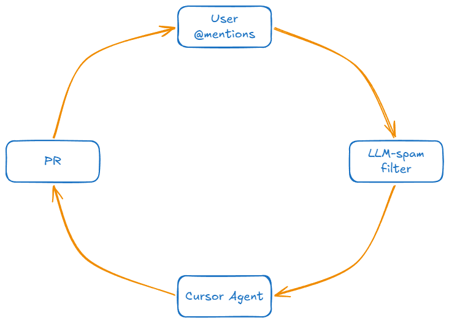

# Feedback to Feature: Creating an auto-feedback loop for product launches using the X API

## Abstract

You've toiled away for days, weeks, maybe even years, and it's finally time to release your product.

Or maybe you're still in the development stage and you love interacting with your community as you build.

Either way, X is the place to be for so many reasons, one of those being how easy it is to use the **X API** to automatically collect any and all user feedback for your product, and even take automatic action on those items such as opening PRs, submitting to a ticketing queue, etc.

